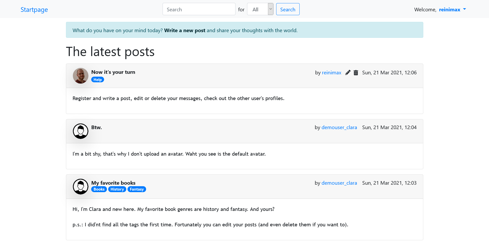

# Message Board

This is a message board to show off my php skills! It uses a MVC pattern whose structure is based on the last project we did at the Wifi course I participated in. For the general idea of a message board and its possible features I was inspired by some of the projects in the Ruby on Rails and Node.js courses at [The Odin Project](https://www.theodinproject.com).

## Features
- At the core, this project is based upon my own MVC framework with REST architecture. This makes it easy to maintain and to extend.
- Classes for database connection, sessions and image manipulation. The first two implement a singleton pattern.
- Classes are integrated using PSR-4 standard and the Composer autoload module.
- Users can write, view, edit and delete their messages. They may add tags to their messages.
- Search for user, message title or tag.
- Users can add additional information and even an avatar to their profile. They can view other user's profiles.
- Users can change their password and delete their account.
- The page that shows the messages is paginated and the number of messages per page can be chosen.

## Page structure/Functionality

### Controllers/Models
- Application, which is kind of the "supercontroller" of the whole application
  - It registers and stores the routes.
  - It retrieves the path the user entered and the request method
  - When the user navigates to a certain route, the appropriate controller with the appropriate method is called
    - HomeController handles Login, Signup.
    - PostController handles displaying and manipulating posts.
    - UserController handles displaying, updating and deleting users.
  - Each controller references a corresponding model that interacts with the database and returns the data retrieved from there. The controller returns this data then to Application and Application calls the view and passes the data.

### Views
- The views are in essence php documents that render the data from Application.
- A class View grabs the appropriate document and fills in the received data.
- Navigating or entering data and sending it will redirect to index.php (thanks to the htaccess file), which will call Application, which will check the route and call the corresponding controller with the appropriate method and so on ... 

### Database:
- There are four tables in the database: 
  - users, which has a 1:n relationship with the table posts.
  - posts, as mentioned above.
  - Tags are stored in a table tags which has a m:n relationship with the table posts.
  - The fourth table, posts_tags, is a pivot table that establishes the relationship between posts and tags.
- The file sql.php contains the DDL statements to create these tables. Either execute the file or copy the MySQL statements e.g. into phpMyAdmin.

### Routes
- Routes are registered in routes/web.php
- There are four methods for registering routes: `registerGet()`, `registerPost()`, `registerPut()` and `registerDelete()`.
- Each method accepts two arguments:
  - The first argument is a string naming the route
  - The second argument is an array with the location of the controller and the method that should be called. 

## Resources used
- [Bootstrap](https://getbootstrap.com/)
- [Composer](https://getcomposer.org/)
- [GUMP](https://github.com/Wixel/GUMP)
- User avatars (in the live demo, except mine) are from [Pexels](https://www.pexels.com)
- Default user avatar is from [UXWing](https://uxwing.com/)
- Icons are from [Font Awesome](https://fontawesome.com/)

## Demo
[View it here](https://messageboard.reinholdschachner.at/)

## Reflection (skip this, it will probably bore you)
- I learned a lot of stuff doing this project.
- The code is not very DRY. Part of this is because I tried to do this project quite fast and copied a lot of stuff. In real life it would be a good idea to refactor the code.
- What I really want to do next time from the beginning on is to make a constant PRODUCTION that is set either to true or false. Depending on this flag, I can then set error reporting, put out different custom error messages etc. It's also cool to have a configuration file like for the database. So I can simply switch that file out for deployment without messing around with the code itself. It's best to start with this, otherwise deployment and updating become a horror.
- Everything is still very rough-hewn. This is intentional. One could spend weeks on end with a project like this. But I will learn more if I leave it in this state and move on to something new. My goal was above all to show my php skills. That's also the reason why there's no JavaScript and hardly any styling.

### This being said, there are still some things that I may add in the future ...
- Send a newly registered user a welcome mail & Forgot password option
- A like/dislike system
- Email notifications (e.g. when you got a like) and connected to this, the ability to follow users/tags
- Allow formatting messages, adding images and links
- Comments
- Private messages between users

### ... and some things that need to be done when updating/reworking this project
- Gif's are actually not tested. Test them.
- Should check for image size before uploading
- Pagination could be turned into a class
- Posts are not deleted automatically when a user deletes her profile - add a checkbox for this option
- UI/UX:
  - Obviously, at some point I want to style this beyond bootstrap
  - Responsive behavior has still some problems
    - The navbar and pagination start breaking around 800px width
    - The posts start breaking around 450px width

### REST
- So, I came to the question of how to implement the PUT and DELETE requests
- There seem to be two main options here (I refer to [this post](https://stackoverflow.com/questions/12085619/php-rest-put-delete-options)):
  - Send an XMLHttpRequest via JavaScript.
  - Make a hidden form that submits the real method via POST and check for it in the controller. I decided to go this way for now. It should work well with PUT because only ever a single post can be updated at a time. DELETE may become problematic because I'm adding a lot of hidden forms. Maybe I will change something there in the future.
  - A third option would be to make this a proper standalone REST API and separate it completely from the frontend. Well, this may be a project for another time.

### Search function
- I had quite some fun researching and experimenting with implementing a search function. 
- At first I tried the LIKE clause, which worked fine at the first attempt, but turned out to be actually quite limited. Also, it is stated that it eats up much performance though for the scope of this project this would probably be no problem.
- Then I tried the MySql Fulltext search, which is far mightier, more flexible, and also quite weird at times (I'll never wonder again when I get weird search results somewhere). I played around with the boolean mode, but decided to leave it in natural language mode for simplicity's sake. The boolean mode would be cool for a dedicated search mask.
- I also found out that there are external full-text engines. 

### Tags
- This proved more troublesome than expected. I settled for an easy way out by displaying them in the create/edit form as a select with multiple options. That's certainly not great UX/UI, but it accomplishes what I intended: to model and implement an m:n relationship between tables.
- Originally I envisioned having a button that creates a new element (like a datalist) where the user kann select or add a new tag. Via this button a number of these elements could be created. It turned out that the architecture of this project is not really well suited for that. It could be done with JavaScript but then it would also be better to send an XHR via JavaScript to the Backend instead of just submitting the form. This approach would favor also a separation between frontend and backend.
- Another problem is, that creating new tags redirects to a new page. So all input when the user was writing/editing a post ist lost. Also this is a case for an architecture that separates frontend and backend. Or at least for something that doesn't always create a new view when a request is sent.

### Avatars
- The user-avatars took some doing, but it was an interesting research where I learned some new stuff and finally getting it right was very satisfying.
- The original premise was that I didn't want to save the avatars in the public folder, where anyone could access them, but in an uploads folder outside the public folder.
- This led to a problem: I cannot point to this place in the `src` attribute of the `` tag because it is a filepath, not a URL.
- My first try was to output the image directly with the `imagepng()` function (my test-image was a png). There are two catches I found on php.net:
  - Using the output buffer to save the image in a variable (awesome!)
  - When outputting the image directly to the browser (which is done by setting the filepath to null), the other parameters of the function need to be explicitly stated
- Well, at first, this didn't really help me much. I tried including a separate file where I outputted the image, which obviously didn't work, and linking to that file left me with the same problem I started with.
- In the meantime, while souring google, I came across a lot of posts discussing saving images in a MySQL database. I had no luck finding any answers to my original question ("How the heck do I display an image that lies outside my public folder?"), but this MySQL stuff left me curious. "Ok, so people save their images in a database. But how do they get them out of the database again and display them on their site?"
- This question finally yielded the answer in the form of [this tutorial](https://www.digitalocean.com/community/tutorials/how-to-use-the-mysql-blob-data-type-to-store-images-with-php-on-ubuntu-18-04). It turns out the answer lies in using the [data URI scheme](https://en.wikipedia.org/wiki/Data_URI_scheme) in the `src` attribute! 
- The last step was to learn that also the image-variable that I created via output-buffer and the `imagepng()` function needs to be base_64 encoded. Nice! Learned something.
